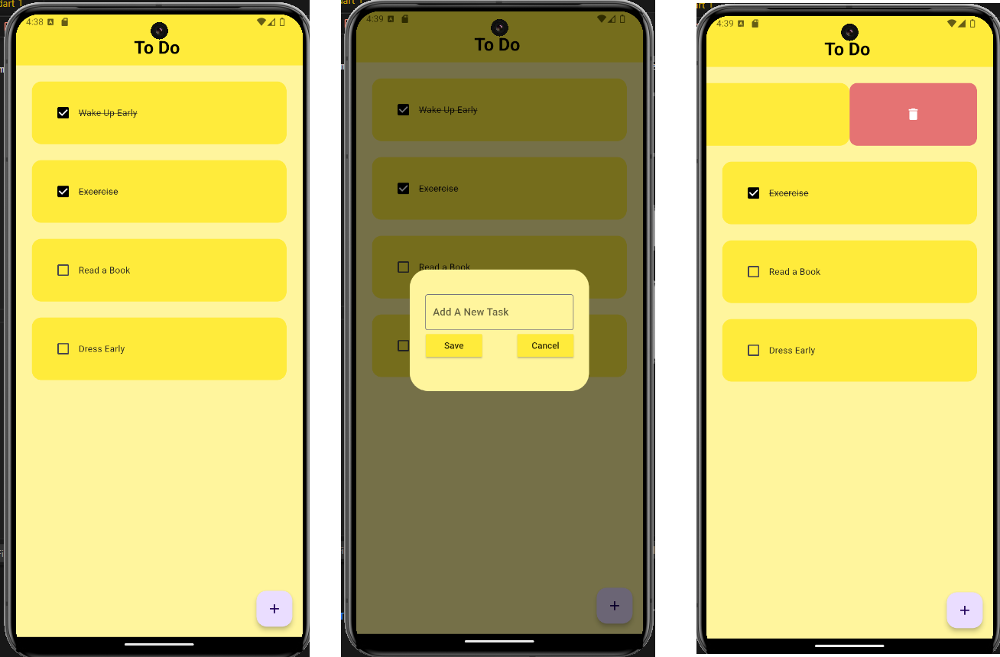

# ToDo App

A simple Flutter To-Do application that allows users to add, mark as complete, and delete tasks. This application demonstrates basic Flutter concepts such as state management, dialog boxes, list views, and local storage using Hive.

## Features

- Add new tasks
- Mark tasks as completed
- Delete tasks
- Persistent task list using Hive

## Screenshots

<!-- Add your UI screenshots here -->


## Getting Started

### Prerequisites

- [Flutter](https://flutter.dev/docs/get-started/install) installed on your machine

### Installation

1. Clone the repository
    ```sh
    git clone https://github.com/yourusername/todoapp.git
    ```
2. Navigate to the project directory
    ```sh
    cd todoapp
    ```
3. Install dependencies
    ```sh
    flutter pub get
    ```
4. Generate the Hive Type Adapter
    ```sh
    flutter packages pub run build_runner build
    ```
5. Run the app
    ```sh
    flutter run
    ```
